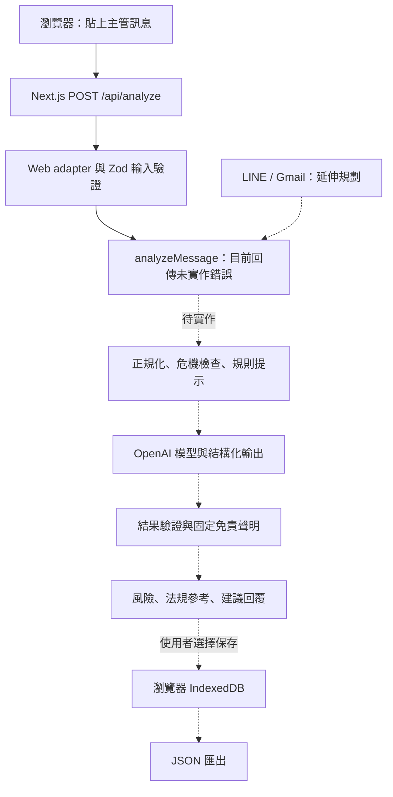

# 界線守門員

看懂主管訊息中的勞權風險，準備冷靜、保留權益的下一步。

界線守門員是一款面向台灣受雇勞工的職場溝通輔助工具，規劃讓使用者貼上收到的主管訊息，取得風險提示、法規參考與建議回覆，並自行保存諮詢紀錄。

本專案參與 **FUTUREMODE BUILDMODE — Track 03 Future of Work**。

> **開發狀態：基礎架構階段。** 網頁表單、輸入驗證及健康檢查已建立；分析核心尚未實作，有效的分析請求目前會回傳 HTTP `501`。設定 API 金鑰也不會啟用 AI 分析。

既有規格、介面及程式識別仍使用舊名「勞權濾網／Labor Filter」。本 README 採用新名稱「界線守門員」；產品規格與技術設計分別見根目錄 [SPEC.md](SPEC.md) 與 [ARCHITECTURE.md](ARCHITECTURE.md)。

## 問題與目標

收到強硬的主管訊息時，勞工往往需要自行查找法規、判斷是否涉及不合理要求，並思考如何回覆。界線守門員希望把這些步驟整合成可理解的溝通流程，協助使用者釐清風險、保留書面脈絡，必要時再向專業管道求助。

主要使用者為一般受雇勞工；未來也希望透過結構化匯出，協助工會及勞工團體整理諮詢資料。降低查找與回覆時間、改善諮詢交接品質是待驗證的產品目標，目前尚無成效數據。

## 核心功能

### 已建立

- 繁體中文訊息輸入頁面，可送出訊息至 `POST /api/analyze`。
- API 輸入驗證，接受 1 至 8,000 個字元的訊息，拒絕空白或格式錯誤的輸入。
- `GET /api/health` 健康檢查。
- 分析結果型別、Zod schema、固定免責聲明及通道介面。
- 官方法規來源、摘要與版本資料，整理於 [assets/legal/](assets/legal/README.md)，尚未接入分析流程。

### MVP 規劃

- **風險辨識：** 提示職場霸凌、加班、調動、逼退等可能風險，區分合理但嚴厲的管理回饋。
- **解釋與回覆：** 提供白話說明、法規參考、繁體中文建議回覆及後續行動。
- **本機案件紀錄：** 由使用者選擇保存至瀏覽器 IndexedDB，並匯出 JSON 諮詢摘要。
- **示範模式：** 使用預植訊息與規則或 mock，在不呼叫外部模型的情況下驗證分類。
- **危機分流：** 偵測自傷或傷人訊息後停止法律分析，改提供求助資源。

上述 MVP 流程仍待實作；`/log` 目前為提示頁，預植訊息資料目前為空。

## 系統架構

所有通道共用 `analyzeMessage()`，避免在 LINE 或 Gmail 各自維護法律判斷。下圖區分現有入口與規劃中的處理流程。



目前沒有後端資料庫，也未呼叫外部模型。規劃中的即時分析會將訊息送往伺服器及模型服務處理，但不將訊息本文寫入伺服器資料庫；案件紀錄預計只在使用者裝置保存。這不代表未來即時分析完全在本機執行。

```text
app/                 頁面、分析 API、健康檢查及 webhook 骨架
components/          訊息輸入、結果與免責聲明元件
src/analysis/        共用分析核心、schema、規則與提示詞骨架
src/adapters/        Web 輸入處理及 LINE、Gmail 介面
src/case-log/        本機案件紀錄與匯出骨架
assets/legal/        官方法規來源、摘要與版本資訊
assets/fixtures/     預植訊息資料位置
tests/               輸入、骨架與法律資料 metadata 測試
```

## 使用技術

| 類型 | 技術／服務 | 用途 |
| --- | --- | --- |
| 前端 | Next.js 16、React 19、Tailwind CSS 4 | App Router 與繁體中文操作介面 |
| 後端 | Next.js Route Handlers | 分析入口、驗證及健康檢查 |
| 型別與驗證 | TypeScript、Zod 4 | 輸入與分析結果契約 |
| 測試 | Vitest、ESLint | 單元測試與靜態檢查 |
| AI 模型（規劃） | OpenAI、Vercel AI SDK | 結構化分析；尚未安裝 SDK 或串接，模型待定 |
| 本機儲存（規劃） | IndexedDB | 使用者自選保存案件，不需後端資料庫 |
| 部署／Sponsor 技術（規劃） | Vercel | Next.js 託管與公開展示；尚未提供部署連結 |

## 安裝與執行

先下載或 clone 此儲存庫，進入專案根目錄。開發環境可使用 Node.js 24 與專案指定的 pnpm `11.9.0`。

```bash
# 已有相容版本時可略過安裝。
npm install --global pnpm@11.9.0

pnpm install --frozen-lockfile
pnpm dev
```

開啟 [http://localhost:3000](http://localhost:3000)。目前可操作訊息表單並查看「分析核心將在下一階段啟用」提示。

### 環境變數

目前啟動網站及執行測試均不需要金鑰。後續串接服務時，可建立本機設定檔：

```bash
cp .env.example .env.local
```

- `OPENAI_API_KEY`：預留給未來的即時分析。
- `LINE_CHANNEL_ACCESS_TOKEN`、`LINE_CHANNEL_SECRET`、`LINE_LIFF_ID`：預留給 LINE 延伸整合。

不要提交 `.env.local`、金鑰或 Token；範例變數請維護於 [.env.example](.env.example)。

### 驗證與正式模式

```bash
pnpm test
pnpm lint
pnpm exec tsc --noEmit
pnpm build
pnpm start
```

`pnpm start` 需先完成 `pnpm build`。現有測試不需 OpenAI；預植訊息分類、合理管理負例與案件儲存測試仍為待辦，測試通過不代表分析能力已完成。

服務啟動後，可檢查 API：

```bash
curl http://localhost:3000/api/health
# 預期：{"status":"ok","service":"labor-filter"}

curl -i http://localhost:3000/api/analyze \
  -H 'Content-Type: application/json' \
  -d '{"text":"請明天準時到班。"}'
# 目前預期：HTTP 501，error.code 為 ANALYSIS_NOT_IMPLEMENTED
```

無效 JSON 或不符合輸入條件的請求會回傳 HTTP `400`。

## 作品展示

- 作品展示網址：尚未提供。
- 評選影片：尚未提供。
- 目前可重現：啟動網站、貼上訊息、確認 API 未啟用提示及健康檢查。
- 完整展示規劃：依序呈現霸凌風險、加班要求、合理管理負例，再保存與匯出諮詢摘要。詳見 [SPEC.md §10](SPEC.md#10-demo-script-3-min)，待核心功能完成後執行。

## 限制與未來工作

- **尚未提供實際分析：** 分析核心、模型呼叫、規則與危機檢查目前為未實作骨架。
- **尚未完成保存與匯出：** IndexedDB、JSON 與 PDF 匯出均不可用；優先完成 JSON。
- **示範可靠性待驗證：** 需補齊預植訊息與分類測試，尤其是合理但嚴厲的管理回饋負例。
- **判斷範圍有限：** 產品定位為單則訊息的風險提示，個案認定仍需情境與證據，不提供違法判決或勝訴保證。
- **整合與上線待完成：** LINE、Gmail、瀏覽器擴充功能、PDF、RAG 與多訊息模式均屬後續方向；公開部署前仍需完成服務防護與驗證。
- **名稱待同步：** 介面、固定聲明與規格仍保留「勞權濾網」，後續可統一產品名稱。

本工具不提供雇主監控、員工評分或自動申訴。現行規格要求保留以下固定聲明，原文沿用舊名稱：

> 勞權濾網使用 AI 提供一般性勞動法資訊與溝通建議，不構成法律意見或律師代理。個案認定需綜合情境與證據。如需申訴或法律協助，請洽 1955 勞工諮詢申訴專線或專業律師。

## 第三方服務、資料與素材

- **官方法律資料：** 來源包含法務部全國法規資料庫、勞動部與職業安全衛生署。各筆來源連結、版本及授權紀錄見 [官方來源清單](assets/legal/source-inventory.zh-TW.md)，使用方式見 [法律資料說明](assets/legal/README.md)。依該清單記錄，使用資料須保留政府資料開放授權條款第 1 版等適用條件與來源顯名；個別素材限制以來源聲明為準。
- **開源依賴：** Next.js、React、Tailwind CSS、Zod、TypeScript、Vitest 與 ESLint 等，版本見 [package.json](package.json) 與 [pnpm-lock.yaml](pnpm-lock.yaml)。各套件依其隨附 LICENSE 使用，不由本專案統一變更授權。
- **外部服務（規劃）：** OpenAI 模型服務、Vercel 託管及 LINE／Gmail 整合，須依各服務條款與 API 權限使用；目前分析核心尚未串接外部服務。
- **示範訊息：** 預計使用人工編寫的情境，不提交真實主管訊息或可識別個人資料；目前 fixture 清單尚未填入。

## 團隊成員

| 姓名 | 分工 |
| --- | --- |
| 待補 | 待團隊確認姓名與實際分工 |

## License

目前儲存庫尚未提供根目錄 `LICENSE`，程式碼授權待團隊決定。第三方套件與政府資料仍依各自授權條件使用。
