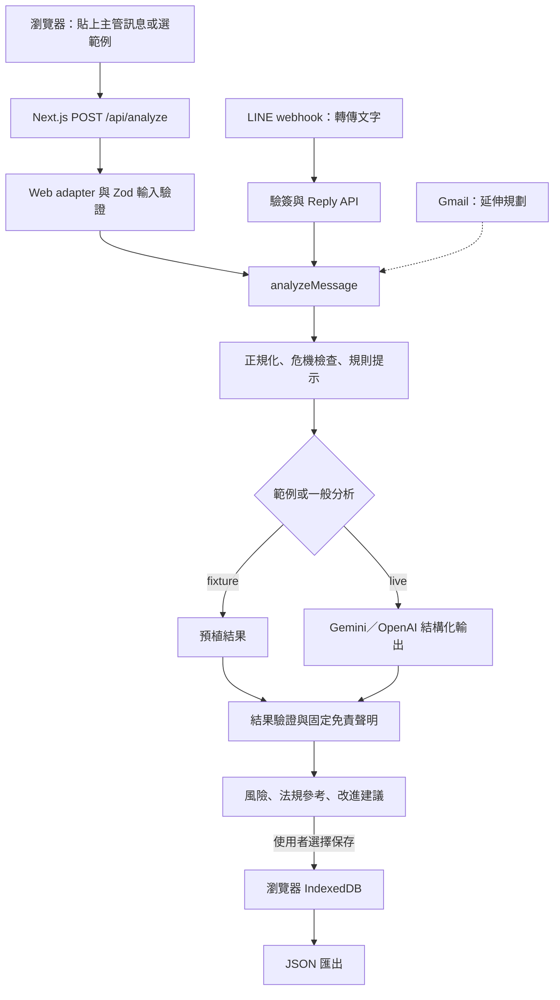

# 界線守門員

看懂主管訊息中的勞權風險，準備冷靜、保留權益的下一步。

界線守門員是一款面向台灣受雇勞工的職場溝通輔助工具，讓使用者貼上收到的主管訊息，取得風險提示、法規參考與回覆改進建議，並自行保存諮詢紀錄。

本專案參與 **FUTUREMODE BUILDMODE — Track 03 Future of Work**。

> **開發狀態：Web MVP 可展示；LINE bot 已接上共用分析核心。** 可貼上訊息或使用範例情境完成分析、複製諮詢摘要、儲存本機案件紀錄並匯出 JSON。範例情境不需模型金鑰。一般分析需設定 Gemini／Vertex 或 OpenAI 憑證。LINE 需官方帳號與 webhook，步驟見 [docs/line-integration.md](docs/line-integration.md)。Gmail 仍為延伸項目。

既有規格、介面及程式識別仍使用舊名「勞權濾網／Labor Filter」。本 README 採用新名稱「界線守門員」；產品規格與技術設計分別見根目錄 [SPEC.md](SPEC.md) 與 [ARCHITECTURE.md](ARCHITECTURE.md)。展示步驟見 [docs/web-demo.md](docs/web-demo.md)。

## 問題與目標

收到強硬的主管訊息時，勞工往往需要自行查找法規、判斷是否涉及不合理要求，並思考如何回覆。界線守門員希望把這些步驟整合成可理解的溝通流程，協助使用者釐清風險、保留書面脈絡，必要時再向專業管道求助。

主要使用者為一般受雇勞工；未來也希望透過結構化匯出，協助工會及勞工團體整理諮詢資料。降低查找與回覆時間、改善諮詢交接品質是待驗證的產品目標，目前尚無成效數據。

## 核心功能

### 已建立

- 繁體中文分析頁：貼上訊息或選擇「範例情境」，送出至 `POST /api/analyze`。
- 離線範例分析（`mode: "fixture"`）與一般分析（Gemini／Vertex，OpenAI 為備援）。
- 風險等級、白話解釋、可展開法規來源、回覆改進建議、下一步與固定免責聲明。
- 可選工作背景（職務、產業、先前訊息則數），僅用於一般分析的脈絡提示。
- 複製改進建議或諮詢摘要；明確儲存後寫入瀏覽器 IndexedDB，可匯出 JSON。
- 危機字詞改提供 1925／1995／1955 等資源，不進行一般法律分析。
- `GET /api/health` 健康檢查。
- 官方法規來源、摘要與版本資料，見 [assets/legal/](assets/legal/README.md)。

### 展示用範例

評審展示組：言語羞辱與排擠、要求無薪加班、突然調動與減薪、逼簽自願離職、嚴格但合理的績效回饋。請勿修改範例原文，否則會切換成一般分析。

## 系統架構

所有通道共用 `analyzeMessage()`，避免在 LINE 或 Gmail 各自維護法律判斷。下圖區分現有入口與規劃中的處理流程。



目前沒有後端資料庫。範例分析不呼叫外部模型。一般分析會將訊息送往伺服器及模型服務，但不將訊息本文寫入伺服器資料庫；案件紀錄只在使用者明確儲存後留在裝置上，且不含主管原始訊息。

```text
app/                 頁面、分析 API、健康檢查及 LINE webhook
components/          訊息輸入、結果、複製與案件紀錄介面
src/analysis/        共用分析核心、schema、規則與提示詞
src/adapters/        Web 輸入處理、LINE Messaging API、Gmail 介面
src/case-log/        本機案件紀錄與 JSON 匯出
assets/legal/        官方法規來源、摘要與版本資訊
assets/fixtures/     預植訊息
tests/               分析、介面與案件紀錄測試
```

## 使用技術

| 類型 | 技術／服務 | 用途 |
| --- | --- | --- |
| 前端 | Next.js 16、React 19、Tailwind CSS 4 | App Router 與繁體中文操作介面 |
| 後端 | Next.js Route Handlers | 分析入口、驗證及健康檢查 |
| 型別與驗證 | TypeScript、Zod 4 | 輸入與分析結果契約 |
| 測試 | Vitest、ESLint | 單元測試與靜態檢查 |
| AI 模型 | Gemini／Vertex、OpenAI、Vercel AI SDK | 一般分析的結構化輸出；範例情境不呼叫模型 |
| 本機儲存 | IndexedDB | 使用者自選保存案件，不需後端資料庫 |
| 部署 | Vercel | https://genai-hack-amber.vercel.app |

## 安裝與執行

先下載或 clone 此儲存庫，進入專案根目錄。開發環境可使用 Node.js 24 與專案指定的 pnpm `9.15.0`。

```bash
# 已有相容版本時可略過安裝。
npm install --global pnpm@9.15.0

pnpm install --frozen-lockfile
pnpm dev
```

開啟 [http://localhost:3000](http://localhost:3000)。可選擇「評審展示」範例並按下「檢查這則訊息」，無需模型金鑰。

### 環境變數

目前啟動網站及執行測試均不需要金鑰。一般分析需本機或部署環境的模型憑證：

```bash
cp .env.example .env.local
```

- `GOOGLE_SERVICE_ACCOUNT_JSON`、`GOOGLE_CLOUD_PROJECT` 或 `GOOGLE_GENERATIVE_AI_API_KEY`：一般分析（Gemini／Vertex）。
- `OPENAI_API_KEY`：可選備援。
- `LINE_CHANNEL_ACCESS_TOKEN`、`LINE_CHANNEL_SECRET`：LINE Messaging API bot。設定步驟見 [LINE 整合](docs/line-integration.md)。

不要提交 `.env.local`、金鑰或 Token；範例變數請維護於 [.env.example](.env.example)。

### 驗證與正式模式

```bash
pnpm test
pnpm lint
pnpm exec tsc --noEmit
pnpm build
pnpm start
```

`pnpm start` 需先完成 `pnpm build`。預設測試不需模型金鑰，涵蓋預植情境、合理管理負例、危機分流、本機儲存與匯出。

服務啟動後，可檢查 API：

```bash
curl http://localhost:3000/api/health
# 預期：{"status":"ok","service":"labor-filter"}

curl -i http://localhost:3000/api/analyze \
  -H 'Content-Type: application/json' \
  -d '{"text":"你真是個沒用的廢物，這點事都做不好。以後部門會議不用參加，大家也不用再把工作資訊傳給你。","mode":"fixture"}'
# 預期：HTTP 200，riskLevel 為 high，主分類為 workplace_bullying
```

無效 JSON 或不符合輸入條件的請求會回傳 HTTP `400`。未設定模型憑證的一般分析會回傳 HTTP `503`。

## 作品展示

- 作品展示網址：https://genai-hack-amber.vercel.app
- 評選影片：尚未提供。
- 目前可重現：開啟網站、選評審展示範例、檢查訊息、複製諮詢摘要、儲存並下載 JSON。步驟見 [docs/web-demo.md](docs/web-demo.md)。LINE bot 測試見 [docs/line-integration.md](docs/line-integration.md)。

## 限制與未來工作

- **不代寫完整回覆：** 提供改進建議與諮詢摘要，不輸出可直接貼上的回覆草稿。
- **判斷範圍有限：** 產品定位為單則訊息的風險提示，個案認定仍需情境與證據，不提供違法判決或勝訴保證。
- **PDF 尚未提供：** JSON 匯出為目前唯一匯出路徑。
- **延伸整合：** LINE Messaging API bot 已可轉傳文字並回覆分析；Gmail、瀏覽器擴充功能、RAG 與多訊息模式仍屬後續方向。
- **名稱待同步：** 介面、固定聲明與規格仍保留「勞權濾網」，README 使用「界線守門員」。

本工具不提供雇主監控、員工評分或自動申訴。現行規格要求保留以下固定聲明，原文沿用舊名稱：

> 勞權濾網使用 AI 提供一般性勞動法資訊與溝通建議，不構成法律意見或律師代理。個案認定需綜合情境與證據。如需申訴或法律協助，請洽 1955 勞工諮詢申訴專線或專業律師。

## 第三方服務、資料與素材

- **官方法律資料：** 來源包含法務部全國法規資料庫、勞動部與職業安全衛生署。各筆來源連結、版本及授權紀錄見 [官方來源清單](assets/legal/source-inventory.zh-TW.md)，使用方式見 [法律資料說明](assets/legal/README.md)。依該清單記錄，使用資料須保留政府資料開放授權條款第 1 版等適用條件與來源顯名；個別素材限制以來源聲明為準。
- **開源依賴：** Next.js、React、Tailwind CSS、Zod、TypeScript、Vitest 與 ESLint 等，版本見 [package.json](package.json) 與 [pnpm-lock.yaml](pnpm-lock.yaml)。各套件依其隨附 LICENSE 使用，不由本專案統一變更授權。
- **外部服務：** 一般分析使用 Google Gemini／Vertex 或 OpenAI；網站部署於 Vercel。LINE Messaging API 為選用通道；Gmail 尚未啟用。
- **示範訊息：** 使用人工編寫的合成情境，不提交真實主管訊息或可識別個人資料。

## 團隊成員

| 姓名 | 分工 |
| --- | --- |
| 待補 | 待團隊確認姓名與實際分工 |

## License

目前儲存庫尚未提供根目錄 `LICENSE`，程式碼授權待團隊決定。第三方套件與政府資料仍依各自授權條件使用。
